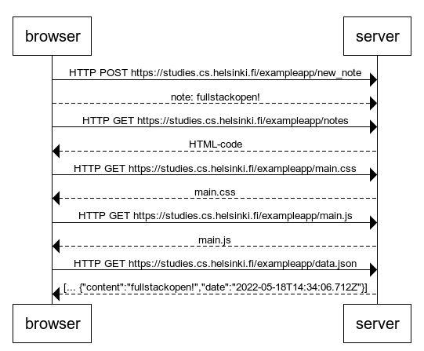

# New note diagram
Made with [websequencediagrams](https://www.websequencediagrams.com/)

Content:
```
browser->server: HTTP POST https://studies.cs.helsinki.fi/exampleapp/new_note
browser-->server: note: fullstackopen!

browser->server: HTTP GET https://studies.cs.helsinki.fi/exampleapp/notes
server-->browser: HTML-code

browser->server: HTTP GET https://studies.cs.helsinki.fi/exampleapp/main.css
server-->browser: main.css

browser->server: HTTP GET https://studies.cs.helsinki.fi/exampleapp/main.js
server-->browser: main.js

browser->server: HTTP GET https://studies.cs.helsinki.fi/exampleapp/data.json
server-->browser: [... {"content":"fullstackopen!","date":"2022-05-18T14:34:06.712Z"}]
```

